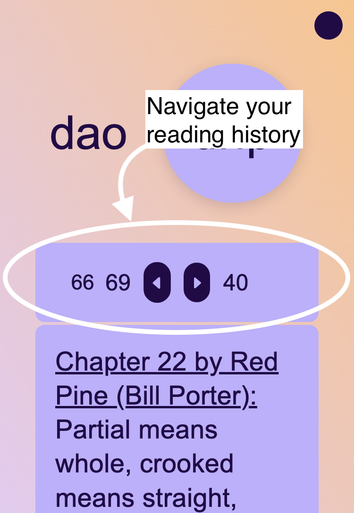

# Dao Drip

Read English translations of the Dàodéjīng ("Dow Duh Jeang") side by side.

## Table of Contents

- [Introduction](#introduction)
- [Usage](#usage)
- [Contributing](#contributing)

## Introduction

Dao Drip is a browser application that allows a user to read several English translations of the Daodejing side by side. To start, the app selects the same random chapter from three different translations. A user's reading history, selected translations, and settings are saved locally in the broswer so they can pick up right where they left off.

## Usage

Use the "Drip" buttons to display a new random chapter.

Use the type-in field and arrow buttons to manually "View" a specific chapter (1-81).

Use the unread chapter links to view a chapter that has not been displayed for you yet. Use the "Reset" button to show all chapter links again.

Use the checkboxes to select your preferred translations and toggle their display.

Translations are displayed in a randomly shuffled order by default. Toggle this setting to have them display in a consistent order.

Navigate your reading history with the arrow buttons.

## Contributing

Contributions are welcome! If you would like to add a new translation, new theme, or improve the code, follow these steps:

1. Fork the repository.
2. Create a new branch for your feature: `git checkout -b feature-name`.
3. Make your changes and commit them: `git commit -m "Add feature"`.
4. Push to your forked repository: `git push origin feature-name`.
5. Open a pull request.

If you identify a bug, translation typo, or want to suggest a new feature please [open an issue](https://github.com/ptrrdrck/daod.rip/issues/new) or feel free to follow the steps above and work on it yourself.
